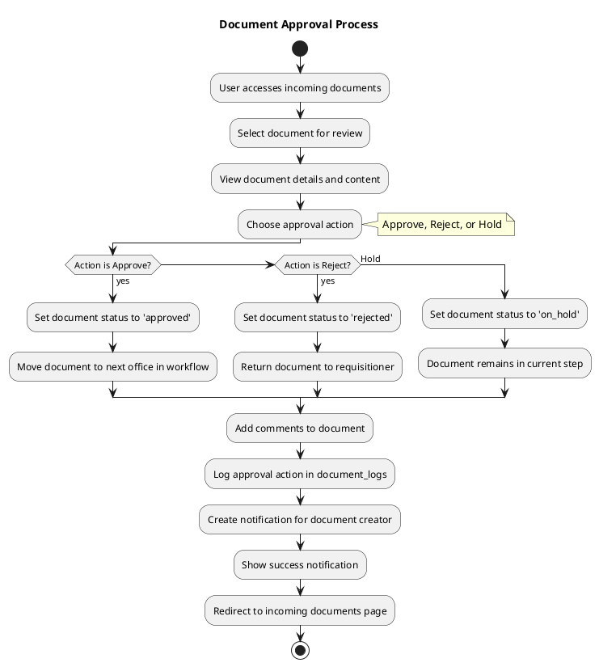

```plantuml
@startuml Approve Document Activity Diagram

title Document Approval Process

start

:User accesses incoming documents;
:Select document for review;
:View document details and content;

:Choose approval action;
note right: Approve, Reject, or Hold

if (Action is Approve?) then (yes)
  :Set document status to 'approved';
  :Move document to next office in workflow;
elseif (Action is Reject?) then (yes)
  :Set document status to 'rejected';
  :Return document to requisitioner;
else (Hold)
  :Set document status to 'on_hold';
  :Document remains in current step;
endif

:Add comments to document;
:Log approval action in document_logs;
:Create notification for document creator;
:Show success notification;

:Redirect to incoming documents page;

stop

@enduml
```
