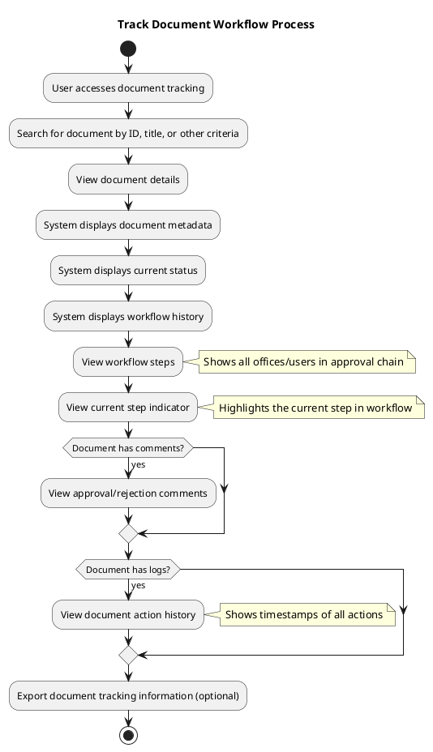

```plantuml
@startuml Track Document Workflow Activity Diagram

title Track Document Workflow Process

start

:User accesses document tracking;
:Search for document by ID, title, or other criteria;

:View document details;
:System displays document metadata;
:System displays current status;
:System displays workflow history;

:View workflow steps;
note right: Shows all offices/users in approval chain

:View current step indicator;
note right: Highlights the current step in workflow

if (Document has comments?) then (yes)
  :View approval/rejection comments;
endif

if (Document has logs?) then (yes)
  :View document action history;
  note right: Shows timestamps of all actions
endif

:Export document tracking information (optional);

stop

@enduml
```
