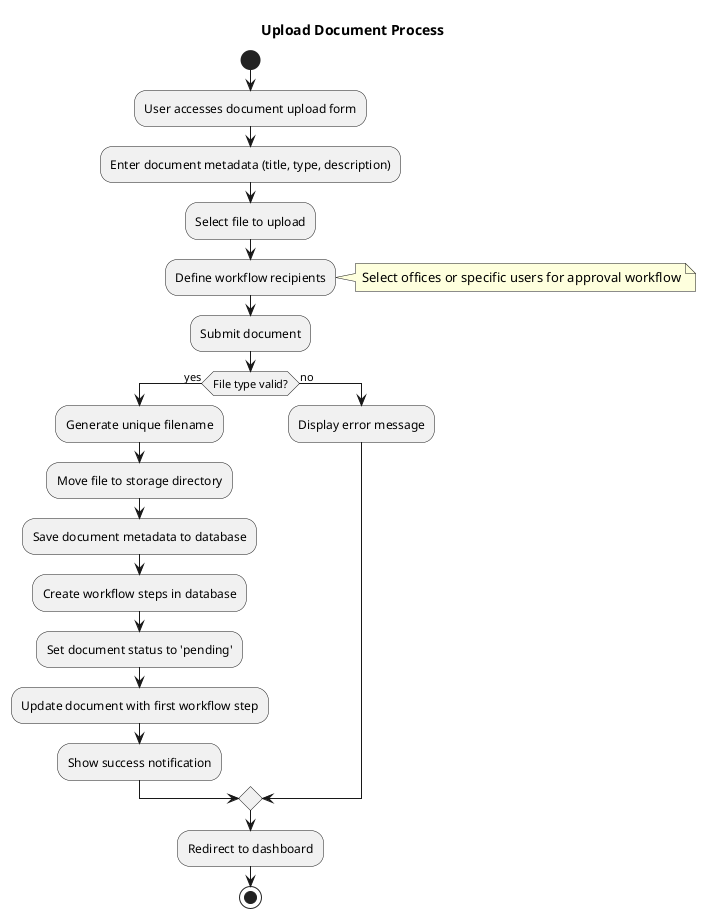

```plantuml
@startuml Upload Document Activity Diagram

title Upload Document Process

start

:User accesses document upload form;

:Enter document metadata (title, type, description);

:Select file to upload;

:Define workflow recipients;
note right: Select offices or specific users for approval workflow

:Submit document;

if (File type valid?) then (yes)
  :Generate unique filename;
  :Move file to storage directory;
  :Save document metadata to database;
  :Create workflow steps in database;
  :Set document status to 'pending';
  :Update document with first workflow step;
  :Show success notification;
else (no)
  :Display error message;
endif

:Redirect to dashboard;

stop

@enduml
```
