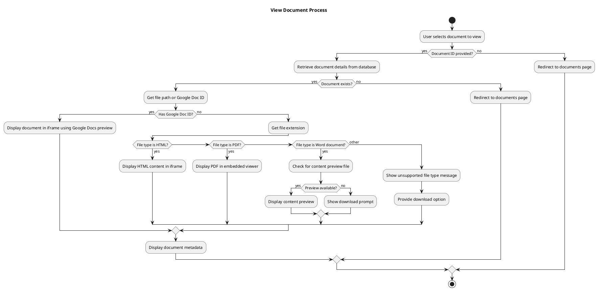

```plantuml
@startuml View Document Activity Diagram

title View Document Process

start

:User selects document to view;

if (Document ID provided?) then (yes)
  :Retrieve document details from database;
  if (Document exists?) then (yes)
    :Get file path or Google Doc ID;
    if (Has Google Doc ID?) then (yes)
      :Display document in iframe using Google Docs preview;
    else (no)
      :Get file extension;
      if (File type is HTML?) then (yes)
        :Display HTML content in iframe;
      elseif (File type is PDF?) then (yes)
        :Display PDF in embedded viewer;
      elseif (File type is Word document?) then (yes)
        :Check for content preview file;
        if (Preview available?) then (yes)
          :Display content preview;
        else (no)
          :Show download prompt;
        endif
      else (other)
        :Show unsupported file type message;
        :Provide download option;
      endif
    endif
    :Display document metadata;
  else (no)
    :Redirect to documents page;
  endif
else (no)
  :Redirect to documents page;
endif

stop

@enduml
```
