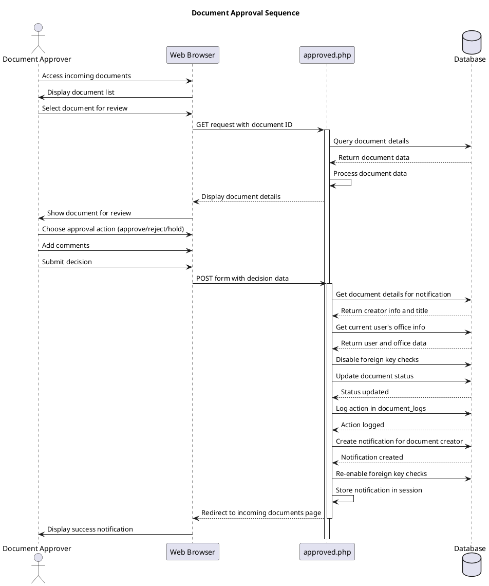

```plantuml
@startuml Approve Document Sequence Diagram

title Document Approval Sequence

actor "Document Approver" as approver
participant "Web Browser" as browser
participant "approved.php" as approve
database "Database" as db

approver -> browser: Access incoming documents
browser -> approver: Display document list

approver -> browser: Select document for review
browser -> approve: GET request with document ID
activate approve

approve -> db: Query document details
db --> approve: Return document data
approve -> approve: Process document data
approve --> browser: Display document details
browser -> approver: Show document for review

approver -> browser: Choose approval action (approve/reject/hold)
approver -> browser: Add comments
approver -> browser: Submit decision

browser -> approve: POST form with decision data
activate approve

approve -> db: Get document details for notification
db --> approve: Return creator info and title

approve -> db: Get current user's office info
db --> approve: Return user and office data

approve -> db: Disable foreign key checks
approve -> db: Update document status
db --> approve: Status updated

approve -> db: Log action in document_logs
db --> approve: Action logged

approve -> db: Create notification for document creator
db --> approve: Notification created

approve -> db: Re-enable foreign key checks

approve -> approve: Store notification in session
approve --> browser: Redirect to incoming documents page
deactivate approve

browser -> approver: Display success notification

@enduml
```
