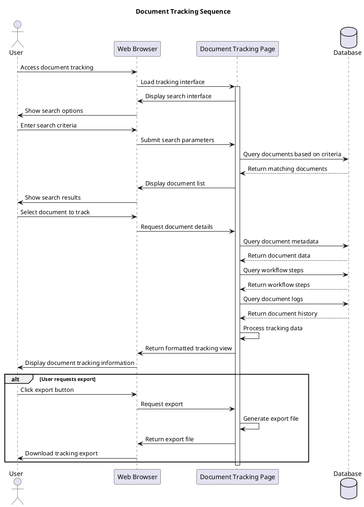

```plantuml
@startuml Track Document Workflow Sequence Diagram

title Document Tracking Sequence

actor "User" as user
participant "Web Browser" as browser
participant "Document Tracking Page" as tracking
database "Database" as db

user -> browser: Access document tracking
browser -> tracking: Load tracking interface
activate tracking

tracking -> browser: Display search interface
browser -> user: Show search options

user -> browser: Enter search criteria
browser -> tracking: Submit search parameters
tracking -> db: Query documents based on criteria
db --> tracking: Return matching documents
tracking -> browser: Display document list
browser -> user: Show search results

user -> browser: Select document to track
browser -> tracking: Request document details
tracking -> db: Query document metadata
db --> tracking: Return document data

tracking -> db: Query workflow steps
db --> tracking: Return workflow steps

tracking -> db: Query document logs
db --> tracking: Return document history

tracking -> tracking: Process tracking data
tracking -> browser: Return formatted tracking view
browser -> user: Display document tracking information

alt User requests export
  user -> browser: Click export button
  browser -> tracking: Request export
  tracking -> tracking: Generate export file
  tracking -> browser: Return export file
  browser -> user: Download tracking export
end

deactivate tracking

@enduml
```
