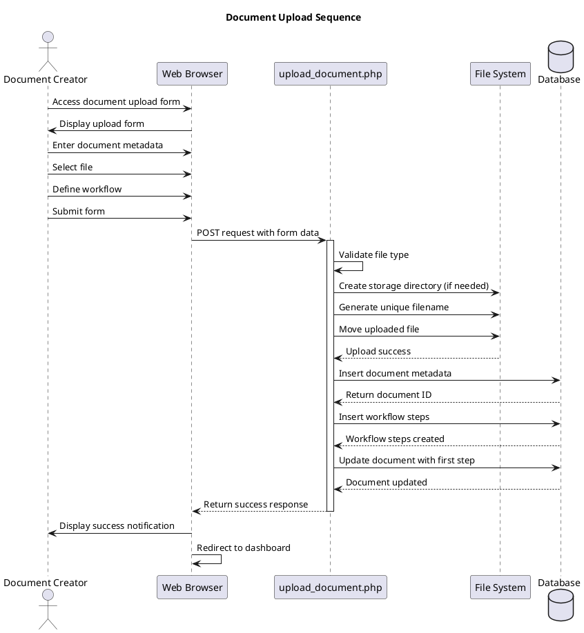

```plantuml
@startuml Upload Document Sequence Diagram

title Document Upload Sequence

actor "Document Creator" as creator
participant "Web Browser" as browser
participant "upload_document.php" as upload
participant "File System" as filesystem
database "Database" as db

creator -> browser: Access document upload form
browser -> creator: Display upload form

creator -> browser: Enter document metadata
creator -> browser: Select file
creator -> browser: Define workflow
creator -> browser: Submit form

browser -> upload: POST request with form data
activate upload

upload -> upload: Validate file type
upload -> filesystem: Create storage directory (if needed)
upload -> filesystem: Generate unique filename
upload -> filesystem: Move uploaded file
filesystem --> upload: Upload success

upload -> db: Insert document metadata
db --> upload: Return document ID

upload -> db: Insert workflow steps
db --> upload: Workflow steps created

upload -> db: Update document with first step
db --> upload: Document updated

upload --> browser: Return success response
deactivate upload

browser -> creator: Display success notification
browser -> browser: Redirect to dashboard

@enduml
```
