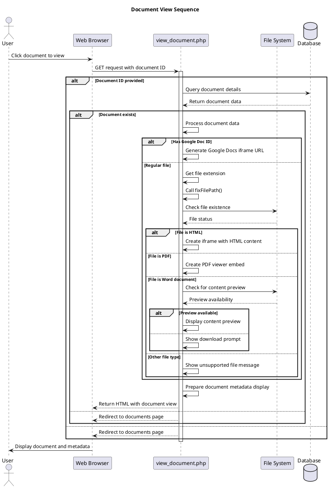

```plantuml
@startuml View Document Sequence Diagram

title Document View Sequence

actor "User" as user
participant "Web Browser" as browser
participant "view_document.php" as view
participant "File System" as filesystem
database "Database" as db

user -> browser: Click document to view
browser -> view: GET request with document ID
activate view

alt Document ID provided
  view -> db: Query document details
  db --> view: Return document data
  
  alt Document exists
    view -> view: Process document data
    
    alt Has Google Doc ID
      view -> view: Generate Google Docs iframe URL
    else Regular file
      view -> view: Get file extension
      view -> view: Call fixFilePath()
      view -> filesystem: Check file existence
      filesystem --> view: File status
      
      alt File is HTML
        view -> view: Create iframe with HTML content
      else File is PDF
        view -> view: Create PDF viewer embed
      else File is Word document
        view -> filesystem: Check for content preview
        filesystem --> view: Preview availability
        alt Preview available
          view -> view: Display content preview
        else
          view -> view: Show download prompt
        end
      else Other file type
        view -> view: Show unsupported file message
      end
    end
    
    view -> view: Prepare document metadata display
    view --> browser: Return HTML with document view
  else
    view --> browser: Redirect to documents page
  end
else
  view --> browser: Redirect to documents page
end

deactivate view

browser -> user: Display document and metadata

@enduml
```
