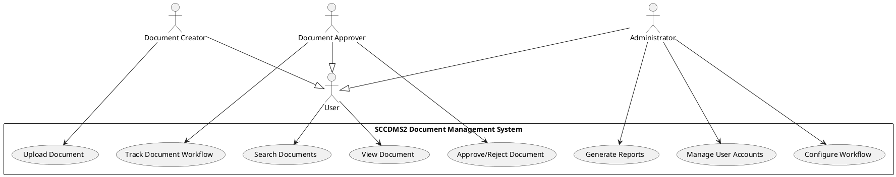

```plantuml
@startuml SCCDMS2 Use Case Diagram

' Define actors
actor "User" as user
actor "Document Creator" as creator
actor "Document Approver" as approver
actor "Administrator" as admin

' Define system boundary
rectangle "SCCDMS2 Document Management System" {
  ' Main use cases
  usecase "Upload Document" as UC1
  usecase "View Document" as UC2
  usecase "Approve/Reject Document" as UC3
  usecase "Track Document Workflow" as UC4
  
  ' Secondary use cases
  usecase "Manage User Accounts" as UC5
  usecase "Configure Workflow" as UC6
  usecase "Search Documents" as UC7
  usecase "Generate Reports" as UC8
}

' Define relationships
user --> UC2
user --> UC7

creator --> UC1
creator --|> user

approver --> UC3
approver --> UC4
approver --|> user

admin --> UC5
admin --> UC6
admin --> UC8
admin --|> user

@enduml
```
