# Google Authentication Flow Diagram

## Mermaid Diagram (for import into editors)

```mermaid
graph LR
    %% User and Login Components
    User[👤 User] --> LoginPage[🖥️ Login Page]
    LoginPage --> GoogleBtn[🔵 Google Login Button]
    
    %% Google OAuth Flow
    GoogleBtn --> GoogleAuth[🔐 Google OAuth 2.0]
    GoogleAuth --> GoogleAPI[🌐 Google API]
    GoogleAPI --> UserInfo[📋 User Information]
    
    %% Authentication System
    UserInfo --> AuthSystem[🔑 Authentication System]
    AuthSystem --> Database[(💾 Database)]
    
    %% User Management
    Database --> UserCheck{❓ User Exists?}
    UserCheck -->|Yes| LoginSuccess[✅ Login Successful]
    UserCheck -->|No| CreateUser[➕ Create New User]
    CreateUser --> LoginSuccess
    
    %% Success Flow
    LoginSuccess --> Dashboard[📊 User Dashboard]
    Dashboard --> GoogleDocs[📄 Google Docs Connect]
    GoogleDocs --> TokenStorage[💾 Token Storage]
    
    %% Error Handling
    GoogleAuth --> AuthError[❌ Authentication Error]
    AuthError --> LoginPage
    
    %% Token Management
    TokenStorage --> TokenValidation{🔍 Token Valid?}
    TokenValidation -->|Yes| APIAccess[🔌 API Access]
    TokenValidation -->|No| TokenRefresh[🔄 Token Refresh]
    TokenRefresh --> GoogleAPI
    APIAccess --> GoogleServices[📚 Google Services]
    
    %% Layout positioning (similar to support ticket system)
    classDef userClass fill:#90EE90
    classDef systemClass fill:#FFD700
    classDef authClass fill:#FF6B6B
    classDef dbClass fill:#FFB6C1
    classDef serviceClass fill:#87CEEB
    classDef errorClass fill:#DDA0DD
    
    class User userClass
    class LoginPage,GoogleBtn,Dashboard systemClass
    class GoogleAuth,AuthSystem,TokenValidation authClass
    class Database,TokenStorage dbClass
    class GoogleAPI,GoogleServices,APIAccess serviceClass
    class AuthError errorClass
```



## PlantUML Diagram (alternative format)

```plantuml
@startuml Google Authentication Flow

!define USER_COLOR #90EE90
!define SYSTEM_COLOR #FFD700
!define AUTH_COLOR #FF6B6B
!define DB_COLOR #FFB6C1
!define SERVICE_COLOR #87CEEB
!define ERROR_COLOR #DDA0DD

actor User as U
rectangle "Login Page" as LP #SYSTEM_COLOR
rectangle "Google Login Button" as GLB #SYSTEM_COLOR
rectangle "Google OAuth 2.0" as GO #AUTH_COLOR
rectangle "Google API" as GA #SERVICE_COLOR
rectangle "User Information" as UI #SERVICE_COLOR
rectangle "Authentication System" as AS #AUTH_COLOR
database "Database" as DB #DB_COLOR
diamond "User Exists?" as UE #AUTH_COLOR
rectangle "Login Successful" as LS #SYSTEM_COLOR
rectangle "Create New User" as CNU #SYSTEM_COLOR
rectangle "User Dashboard" as UD #SYSTEM_COLOR
rectangle "Google Docs Connect" as GDC #SERVICE_COLOR
database "Token Storage" as TS #DB_COLOR
diamond "Token Valid?" as TV #AUTH_COLOR
rectangle "API Access" as AA #SERVICE_COLOR
rectangle "Token Refresh" as TR #SERVICE_COLOR
rectangle "Google Services" as GS #SERVICE_COLOR
rectangle "Authentication Error" as AE #ERROR_COLOR

U --> LP : "1: Access Login"
LP --> GLB : "2: Click Google Login"
GLB --> GO : "3: Redirect to OAuth"
GO --> GA : "4: Authorization Request"
GA --> UI : "5: Return User Data"
UI --> AS : "6: Process User Info"
AS --> DB : "7: Check User Record"
DB --> UE : "8: User Exists?"
UE --> LS : "Yes"
UE --> CNU : "No"
CNU --> LS : "9: Create User"
LS --> UD : "10: Redirect to Dashboard"
UD --> GDC : "11: Connect Google Docs"
GDC --> TS : "12: Store Access Token"
TS --> TV : "13: Validate Token"
TV --> AA : "Valid"
TV --> TR : "Expired"
TR --> GA : "14: Refresh Token"
AA --> GS : "15: Access Google Services"
GO --> AE : "Error"
AE --> LP : "16: Return to Login"

@enduml
```

## Draw.io XML Format (for draw.io/diagrams.net)

```xml
<?xml version="1.0" encoding="UTF-8"?>
<mxfile host="app.diagrams.net" modified="2024-01-01T00:00:00.000Z" agent="5.0" etag="xxx" version="22.1.16" type="device">
  <diagram name="Google Auth Flow" id="google-auth-flow">
    <mxGraphModel dx="1422" dy="794" grid="1" gridSize="10" guides="1" tooltips="1" connect="1" arrows="1" fold="1" page="1" pageScale="1" pageWidth="1169" pageHeight="827" math="0" shadow="0">
      <root>
        <mxCell id="0" />
        <mxCell id="1" parent="0" />
        
        <!-- User -->
        <mxCell id="user" value="👤 User" style="rounded=1;whiteSpace=wrap;html=1;fillColor=#90EE90;strokeColor=#000000;" vertex="1" parent="1">
          <mxGeometry x="40" y="40" width="120" height="60" as="geometry" />
        </mxCell>
        
        <!-- Login Page -->
        <mxCell id="loginPage" value="🖥️ Login Page" style="rounded=1;whiteSpace=wrap;html=1;fillColor=#FFD700;strokeColor=#000000;" vertex="1" parent="1">
          <mxGeometry x="200" y="40" width="120" height="60" as="geometry" />
        </mxCell>
        
        <!-- Google Login Button -->
        <mxCell id="googleBtn" value="🔵 Google Login Button" style="rounded=1;whiteSpace=wrap;html=1;fillColor=#FFD700;strokeColor=#000000;" vertex="1" parent="1">
          <mxGeometry x="360" y="40" width="140" height="60" as="geometry" />
        </mxCell>
        
        <!-- Google OAuth -->
        <mxCell id="googleAuth" value="🔐 Google OAuth 2.0" style="rounded=1;whiteSpace=wrap;html=1;fillColor=#FF6B6B;strokeColor=#000000;" vertex="1" parent="1">
          <mxGeometry x="540" y="40" width="140" height="60" as="geometry" />
        </mxCell>
        
        <!-- Google API -->
        <mxCell id="googleAPI" value="🌐 Google API" style="rounded=1;whiteSpace=wrap;html=1;fillColor=#87CEEB;strokeColor=#000000;" vertex="1" parent="1">
          <mxGeometry x="720" y="40" width="120" height="60" as="geometry" />
        </mxCell>
        
        <!-- User Information -->
        <mxCell id="userInfo" value="📋 User Information" style="rounded=1;whiteSpace=wrap;html=1;fillColor=#87CEEB;strokeColor=#000000;" vertex="1" parent="1">
          <mxGeometry x="880" y="40" width="140" height="60" as="geometry" />
        </mxCell>
        
        <!-- Authentication System -->
        <mxCell id="authSystem" value="🔑 Authentication System" style="rounded=1;whiteSpace=wrap;html=1;fillColor=#FF6B6B;strokeColor=#000000;" vertex="1" parent="1">
          <mxGeometry x="200" y="140" width="160" height="60" as="geometry" />
        </mxCell>
        
        <!-- Database -->
        <mxCell id="database" value="💾 Database" style="shape=cylinder3;whiteSpace=wrap;html=1;boundedLbl=1;backgroundOutline=1;size=15;fillColor=#FFB6C1;strokeColor=#000000;" vertex="1" parent="1">
          <mxGeometry x="400" y="140" width="120" height="60" as="geometry" />
        </mxCell>
        
        <!-- User Exists Check -->
        <mxCell id="userCheck" value="❓ User Exists?" style="rhombus;whiteSpace=wrap;html=1;fillColor=#FF6B6B;strokeColor=#000000;" vertex="1" parent="1">
          <mxGeometry x="600" y="140" width="120" height="80" as="geometry" />
        </mxCell>
        
        <!-- Login Successful -->
        <mxCell id="loginSuccess" value="✅ Login Successful" style="rounded=1;whiteSpace=wrap;html=1;fillColor=#FFD700;strokeColor=#000000;" vertex="1" parent="1">
          <mxGeometry x="760" y="140" width="140" height="60" as="geometry" />
        </mxCell>
        
        <!-- Create New User -->
        <mxCell id="createUser" value="➕ Create New User" style="rounded=1;whiteSpace=wrap;html=1;fillColor=#FFD700;strokeColor=#000000;" vertex="1" parent="1">
          <mxGeometry x="760" y="220" width="140" height="60" as="geometry" />
        </mxCell>
        
        <!-- User Dashboard -->
        <mxCell id="dashboard" value="📊 User Dashboard" style="rounded=1;whiteSpace=wrap;html=1;fillColor=#FFD700;strokeColor=#000000;" vertex="1" parent="1">
          <mxGeometry x="200" y="240" width="140" height="60" as="geometry" />
        </mxCell>
        
        <!-- Google Docs Connect -->
        <mxCell id="googleDocs" value="📄 Google Docs Connect" style="rounded=1;whiteSpace=wrap;html=1;fillColor=#87CEEB;strokeColor=#000000;" vertex="1" parent="1">
          <mxGeometry x="400" y="240" width="160" height="60" as="geometry" />
        </mxCell>
        
        <!-- Token Storage -->
        <mxCell id="tokenStorage" value="💾 Token Storage" style="shape=cylinder3;whiteSpace=wrap;html=1;boundedLbl=1;backgroundOutline=1;size=15;fillColor=#FFB6C1;strokeColor=#000000;" vertex="1" parent="1">
          <mxGeometry x="600" y="240" width="120" height="60" as="geometry" />
        </mxCell>
        
        <!-- Token Validation -->
        <mxCell id="tokenValidation" value="🔍 Token Valid?" style="rhombus;whiteSpace=wrap;html=1;fillColor=#FF6B6B;strokeColor=#000000;" vertex="1" parent="1">
          <mxGeometry x="760" y="240" width="120" height="80" as="geometry" />
        </mxCell>
        
        <!-- API Access -->
        <mxCell id="apiAccess" value="🔌 API Access" style="rounded=1;whiteSpace=wrap;html=1;fillColor=#87CEEB;strokeColor=#000000;" vertex="1" parent="1">
          <mxGeometry x="920" y="240" width="120" height="60" as="geometry" />
        </mxCell>
        
        <!-- Token Refresh -->
        <mxCell id="tokenRefresh" value="🔄 Token Refresh" style="rounded=1;whiteSpace=wrap;html=1;fillColor=#87CEEB;strokeColor=#000000;" vertex="1" parent="1">
          <mxGeometry x="920" y="320" width="120" height="60" as="geometry" />
        </mxCell>
        
        <!-- Google Services -->
        <mxCell id="googleServices" value="📚 Google Services" style="rounded=1;whiteSpace=wrap;html=1;fillColor=#87CEEB;strokeColor=#000000;" vertex="1" parent="1">
          <mxGeometry x="400" y="340" width="140" height="60" as="geometry" />
        </mxCell>
        
        <!-- Authentication Error -->
        <mxCell id="authError" value="❌ Authentication Error" style="rounded=1;whiteSpace=wrap;html=1;fillColor=#DDA0DD;strokeColor=#000000;" vertex="1" parent="1">
          <mxGeometry x="600" y="340" width="160" height="60" as="geometry" />
        </mxCell>
        
        <!-- Connections -->
        <mxCell id="edge1" value="1: Access Login" style="edgeStyle=orthogonalEdgeStyle;rounded=0;orthogonalLoop=1;jettySize=auto;html=1;" edge="1" parent="1" source="user" target="loginPage">
          <mxGeometry relative="1" as="geometry" />
        </mxCell>
        
        <mxCell id="edge2" value="2: Click Google Login" style="edgeStyle=orthogonalEdgeStyle;rounded=0;orthogonalLoop=1;jettySize=auto;html=1;" edge="1" parent="1" source="loginPage" target="googleBtn">
          <mxGeometry relative="1" as="geometry" />
        </mxCell>
        
        <mxCell id="edge3" value="3: Redirect to OAuth" style="edgeStyle=orthogonalEdgeStyle;rounded=0;orthogonalLoop=1;jettySize=auto;html=1;" edge="1" parent="1" source="googleBtn" target="googleAuth">
          <mxGeometry relative="1" as="geometry" />
        </mxCell>
        
        <mxCell id="edge4" value="4: Authorization Request" style="edgeStyle=orthogonalEdgeStyle;rounded=0;orthogonalLoop=1;jettySize=auto;html=1;" edge="1" parent="1" source="googleAuth" target="googleAPI">
          <mxGeometry relative="1" as="geometry" />
        </mxCell>
        
        <mxCell id="edge5" value="5: Return User Data" style="edgeStyle=orthogonalEdgeStyle;rounded=0;orthogonalLoop=1;jettySize=auto;html=1;" edge="1" parent="1" source="googleAPI" target="userInfo">
          <mxGeometry relative="1" as="geometry" />
        </mxCell>
        
        <mxCell id="edge6" value="6: Process User Info" style="edgeStyle=orthogonalEdgeStyle;rounded=0;orthogonalLoop=1;jettySize=auto;html=1;" edge="1" parent="1" source="userInfo" target="authSystem">
          <mxGeometry relative="1" as="geometry" />
        </mxCell>
        
        <mxCell id="edge7" value="7: Check User Record" style="edgeStyle=orthogonalEdgeStyle;rounded=0;orthogonalLoop=1;jettySize=auto;html=1;" edge="1" parent="1" source="authSystem" target="database">
          <mxGeometry relative="1" as="geometry" />
        </mxCell>
        
        <mxCell id="edge8" value="8: User Exists?" style="edgeStyle=orthogonalEdgeStyle;rounded=0;orthogonalLoop=1;jettySize=auto;html=1;" edge="1" parent="1" source="database" target="userCheck">
          <mxGeometry relative="1" as="geometry" />
        </mxCell>
        
        <mxCell id="edge9" value="Yes" style="edgeStyle=orthogonalEdgeStyle;rounded=0;orthogonalLoop=1;jettySize=auto;html=1;" edge="1" parent="1" source="userCheck" target="loginSuccess">
          <mxGeometry relative="1" as="geometry" />
        </mxCell>
        
        <mxCell id="edge10" value="No" style="edgeStyle=orthogonalEdgeStyle;rounded=0;orthogonalLoop=1;jettySize=auto;html=1;" edge="1" parent="1" source="userCheck" target="createUser">
          <mxGeometry relative="1" as="geometry" />
        </mxCell>
        
        <mxCell id="edge11" value="9: Create User" style="edgeStyle=orthogonalEdgeStyle;rounded=0;orthogonalLoop=1;jettySize=auto;html=1;" edge="1" parent="1" source="createUser" target="loginSuccess">
          <mxGeometry relative="1" as="geometry" />
        </mxCell>
        
        <mxCell id="edge12" value="10: Redirect to Dashboard" style="edgeStyle=orthogonalEdgeStyle;rounded=0;orthogonalLoop=1;jettySize=auto;html=1;" edge="1" parent="1" source="loginSuccess" target="dashboard">
          <mxGeometry relative="1" as="geometry" />
        </mxCell>
        
        <mxCell id="edge13" value="11: Connect Google Docs" style="edgeStyle=orthogonalEdgeStyle;rounded=0;orthogonalLoop=1;jettySize=auto;html=1;" edge="1" parent="1" source="dashboard" target="googleDocs">
          <mxGeometry relative="1" as="geometry" />
        </mxCell>
        
        <mxCell id="edge14" value="12: Store Access Token" style="edgeStyle=orthogonalEdgeStyle;rounded=0;orthogonalLoop=1;jettySize=auto;html=1;" edge="1" parent="1" source="googleDocs" target="tokenStorage">
          <mxGeometry relative="1" as="geometry" />
        </mxCell>
        
        <mxCell id="edge15" value="13: Validate Token" style="edgeStyle=orthogonalEdgeStyle;rounded=0;orthogonalLoop=1;jettySize=auto;html=1;" edge="1" parent="1" source="tokenStorage" target="tokenValidation">
          <mxGeometry relative="1" as="geometry" />
        </mxCell>
        
        <mxCell id="edge16" value="Valid" style="edgeStyle=orthogonalEdgeStyle;rounded=0;orthogonalLoop=1;jettySize=auto;html=1;" edge="1" parent="1" source="tokenValidation" target="apiAccess">
          <mxGeometry relative="1" as="geometry" />
        </mxCell>
        
        <mxCell id="edge17" value="Expired" style="edgeStyle=orthogonalEdgeStyle;rounded=0;orthogonalLoop=1;jettySize=auto;html=1;" edge="1" parent="1" source="tokenValidation" target="tokenRefresh">
          <mxGeometry relative="1" as="geometry" />
        </mxCell>
        
        <mxCell id="edge18" value="14: Refresh Token" style="edgeStyle=orthogonalEdgeStyle;rounded=0;orthogonalLoop=1;jettySize=auto;html=1;" edge="1" parent="1" source="tokenRefresh" target="googleAPI">
          <mxGeometry relative="1" as="geometry" />
        </mxCell>
        
        <mxCell id="edge19" value="15: Access Google Services" style="edgeStyle=orthogonalEdgeStyle;rounded=0;orthogonalLoop=1;jettySize=auto;html=1;" edge="1" parent="1" source="apiAccess" target="googleServices">
          <mxGeometry relative="1" as="geometry" />
        </mxCell>
        
        <mxCell id="edge20" value="Error" style="edgeStyle=orthogonalEdgeStyle;rounded=0;orthogonalLoop=1;jettySize=auto;html=1;" edge="1" parent="1" source="googleAuth" target="authError">
          <mxGeometry relative="1" as="geometry" />
        </mxCell>
        
        <mxCell id="edge21" value="16: Return to Login" style="edgeStyle=orthogonalEdgeStyle;rounded=0;orthogonalLoop=1;jettySize=auto;html=1;" edge="1" parent="1" source="authError" target="loginPage">
          <mxGeometry relative="1" as="geometry" />
        </mxCell>
        
      </root>
    </mxGraphModel>
  </diagram>
</mxfile>
```

## Instructions for Import

### For Mermaid:
1. Copy the Mermaid code block
2. Paste into any Mermaid-compatible editor (GitHub, GitLab, Mermaid Live Editor, etc.)

### For PlantUML:
1. Copy the PlantUML code block
2. Paste into PlantUML editor or online PlantUML server

### For Draw.io/Diagrams.net:
1. Copy the XML code block
2. In draw.io, go to File > Import From > Text
3. Paste the XML content
4. The diagram will be imported with all shapes, colors, and connections

### For Lucidchart:
1. Copy the XML code block
2. In Lucidchart, go to File > Import
3. Select "Draw.io XML" format
4. Paste the XML content

## Color Scheme
- **Light Green (#90EE90)**: User components
- **Yellow (#FFD700)**: System/UI components  
- **Red (#FF6B6B)**: Authentication/validation components
- **Pink (#FFB6C1)**: Database/storage components
- **Light Blue (#87CEEB)**: API/service components
- **Purple (#DDA0DD)**: Error components

## Layout Features
- **Horizontal and vertical arrangement** to conserve space (like the support ticket system)
- **Color-coded components** for easy identification
- **Numbered flow steps** for clear process understanding
- **Error handling paths** included
- **Token management** flow for Google services integration 