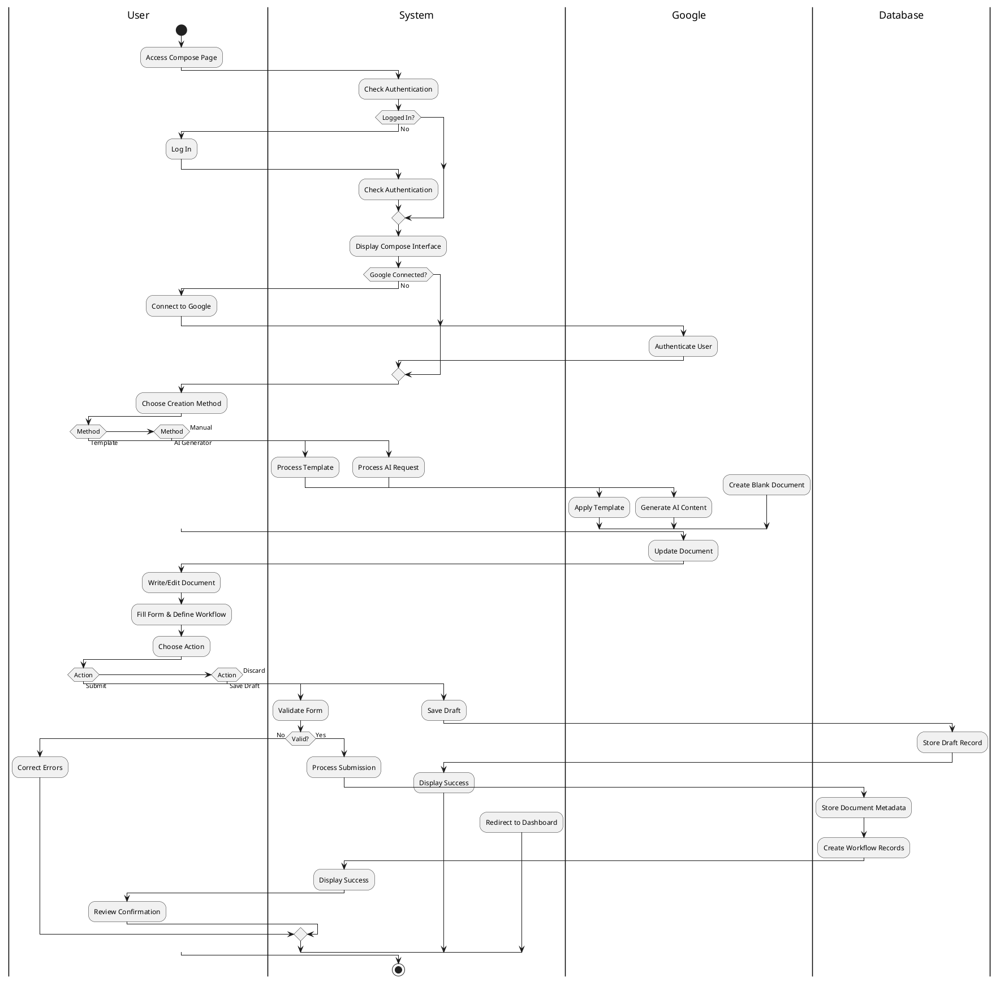

```plantuml
@startuml Document Composition Process

|User|
start
:Access Compose Page;

|System|
:Check Authentication;

if (Logged In?) then (No)
  |User|
  :Log In;
  |System|
  :Check Authentication;
endif

|System|
:Display Compose Interface;

if (Google Connected?) then (No)
  |User|
  :Connect to Google;
  |Google|
  :Authenticate User;
endif

|User|
:Choose Creation Method;

if (Method) then (Template)
  |System|
  :Process Template;
  |Google|
  :Apply Template;
else if (Method) then (AI Generator)
  |System|
  :Process AI Request;
  |Google|
  :Generate AI Content;
else (Manual)
  |Google|
  :Create Blank Document;
endif

|Google|
:Update Document;

|User|
:Write/Edit Document;
:Fill Form & Define Workflow;
:Choose Action;

if (Action) then (Submit)
  |System|
  :Validate Form;
  
  if (Valid?) then (No)
    |User|
    :Correct Errors;
  else (Yes)
    |System|
    :Process Submission;
    
    |Database|
    :Store Document Metadata;
    :Create Workflow Records;
    
    |System|
    :Display Success;
    
    |User|
    :Review Confirmation;
  endif
  
else if (Action) then (Save Draft)
  |System|
  :Save Draft;
  
  |Database|
  :Store Draft Record;
  
  |System|
  :Display Success;
  
else (Discard)
  |System|
  :Redirect to Dashboard;
endif

stop

@enduml
``` 