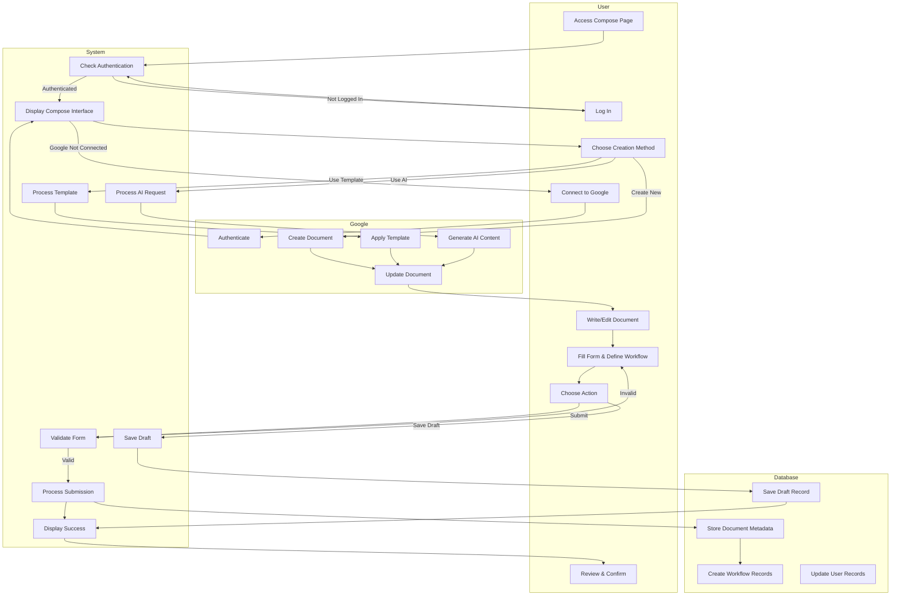

```mermaid
graph TB
    %% Swimlanes
    subgraph User
        U1[Access Compose Page]
        U2[Log In]
        U3[Connect to Google]
        U4[Choose Creation Method]
        U5[Write/Edit Document]
        U6[Fill Form & Define Workflow]
        U7[Choose Action]
        U8[Review & Confirm]
    end
    
    subgraph System
        S1[Check Authentication]
        S2[Display Compose Interface]
        S3[Process Template]
        S4[Process AI Request]
        S5[Validate Form]
        S6[Process Submission]
        S7[Save Draft]
        S8[Display Success]
    end
    
    subgraph Google
        G1[Authenticate]
        G2[Create Document]
        G3[Apply Template]
        G4[Generate AI Content]
        G5[Update Document]
    end
    
    subgraph Database
        D1[Store Document Metadata]
        D2[Create Workflow Records]
        D3[Update User Records]
        D4[Save Draft Record]
    end
    
    %% Connections
    U1 --> S1
    S1 -- Not Logged In --> U2
    U2 --> S1
    
    S1 -- Authenticated --> S2
    S2 -- Google Not Connected --> U3
    U3 --> G1
    G1 --> S2
    
    S2 --> U4
    U4 -- Create New --> G2
    U4 -- Use Template --> S3
    U4 -- Use AI --> S4
    
    S3 --> G3
    S4 --> G4
    
    G2 & G3 & G4 --> G5
    G5 --> U5
    
    U5 --> U6
    U6 --> U7
    
    U7 -- Submit --> S5
    U7 -- Save Draft --> S7
    
    S5 -- Valid --> S6
    S5 -- Invalid --> U6
    
    S6 --> D1
    D1 --> D2
    S6 --> S8
    S8 --> U8
    
    S7 --> D4
    D4 --> S8
``` 